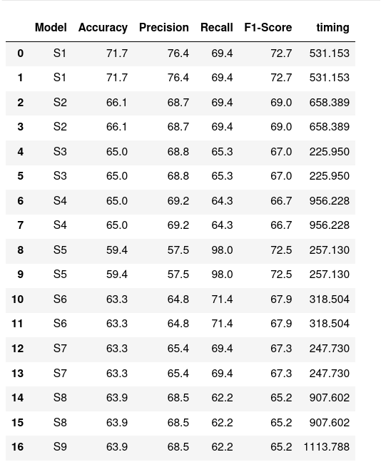
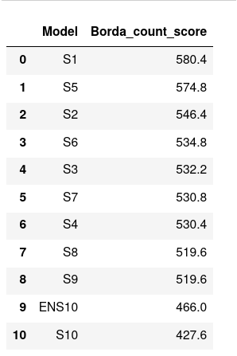

## Borda count voting method

### Description
Implementation of Borda count voting method. This helps ranking models through borda count voting method
based the metrics used to assess the models. The first column of the dataframe must be the models' names
The borda count voting method score is based on the metrics, columns in *considered_columns*

### Languages and Technologies
The implementation is done in python3, pandas for files reading, dictionary for storing the ranked models, and
dataframe for returning the ranked models.

### Bofore applying Borda count

###  Borda count result(on Accuracy, Precision, Recall, F1-Score metrics)

